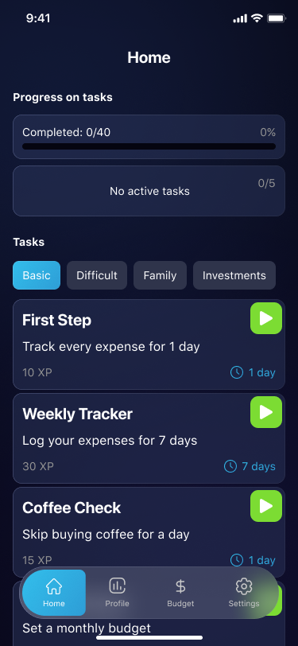
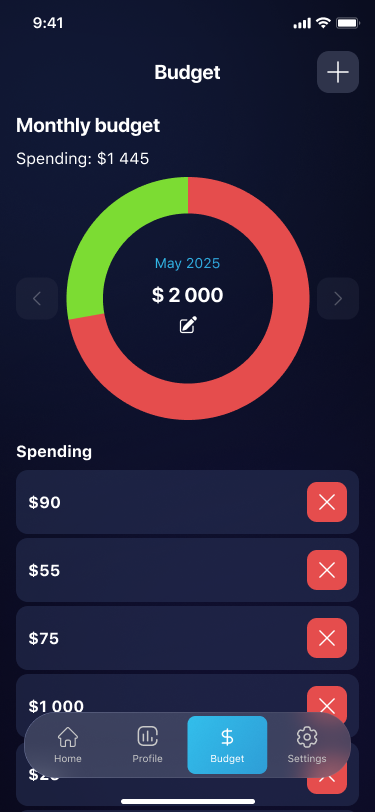

# Power Quest: Money Odyssey

**Power Quest: Money Odyssey** is a gamified Flutter budgeting app that turns expense tracking into an engaging adventure. Set goals, complete financial quests, and level up your budgeting skills through XP and achievements.


## 🛠️ Technologies

- **Flutter** and **Dart**
- **Provider** — state management
- **Custom XP engine** — gamified leveling and achievements
- **Dark theme UI** — fully styled with gradients and transitions
- **Local assets** — icons, badges, and illustrations

## 📱 Screenshots

| Tasks | Profile | Budget |
|--------|--------|---------|
|  |  |  |

## 🚀 How to Run

1. Clone the repo
   ```sh
   git clone https://github.com/NMMustafina/power_quest_money_odyssey.git
   ```
2. Install all the packages by typing the following command
   ```sh
   flutter pub get
   ```
3. Run the App
